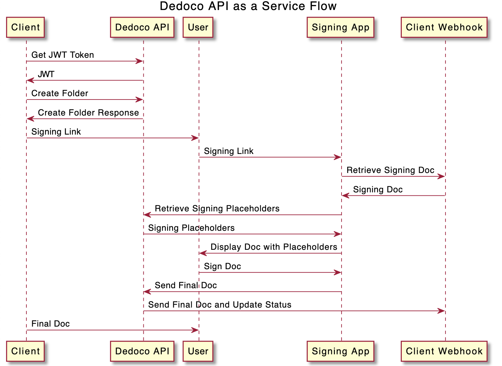

# Introduction

Welcome to Dedoco Platform API Specifications for Developers!

This document contains the API specifications for integration with the Dedoco Platform. The Dedoco platform manages business and document processes and stores the relevant evidence on blockchain. Dedoco APIs interface between the frontend, application logic and the blockchain smart contracts, allowing the document process to be managed in a trusted and immutable manner.

Note for Dedoco Partners integration with API: The data schema and API endpoints described below are generic for the Dedoco platform. When required (depending on the type of integration), custom endpoints can be provided based on the partner’s processes.

### Version History
Date | Content
-----| --------
10 Mar 2021 | Version 0.5<br>Initial Release
12 Mar 2021 | Version 0.6<br>Added attributes details
15 Mar 2021 | Version 0.6a<br>Added API Developer Account process
26 Mar 2021 | Version 0.6b<br>Added sample requests and responses

# A. API Developer Account
To have access to our Early Access (EA) API Platform, please provide the following information and submit your application request to [developers@dedoco.com](mailto:developers@dedoco.com).

Name of Organization:<br>
Business Address:<br>
Business Country:<br>
Business Website URL:<br>

Contact Person (Full Name):<br>
Contact Person (Email):<br>
Contact Person (Mobile):<br>

Application Name:<br>
Application Description/Use Case:<br>
Application Type: [ Internal Use | Public SaaS | Enterprise App | Development | Testing | Others]<br>
Application URL:

After your application has been reviewed and approved, you will receive an email containing the API credentials to access the Dedoco EA API platform. 

# B. Sample API Flows



# C. Authentication

Dedoco uses JWT tokens to allow access to Dedoco’s public API. Clients can request for a JWT token through the Get JWT token endpoint. Dedoco expects for the JWT token to be included in all API requests to the server in a header that looks like the following:

Authorization: Bearer \<jwt_token>

where jwt_token should be replaced with the obtained JWT token. The following section describes the attributes of the JWT token.

## JWT Payload

Attribute | Type | Description
----------|------|-------------
subId | string | Id of the subject (i.e. client id).
subTyp | string | Type of the subject. “public” in this case.
usrName | string | Name of the client’s user the client is requesting the JWT token on behalf of. This attribute will not exist if not provided in the Get JWT token endpoint.
usrEmail | string | Email address of the client’s user the client is requesting the JWT token on behalf of. This attribute will not exist if not provided in the Get JWT token endpoint.
iat | number | Unix time the JWT token was issued at.
exp | number | Unix time the JWT token will expire by.
v | number | Version number of Dedoco’s API that generated the JWT token.

## Endpoints
### <a name="get-jwt-token"></a>1. Get JWT Token 
POST /public/auth/token HTTP/1.1<br>
Generates a JWT token.

Authorization:<br>
Basic <client_id> <client_secret>

Content-Type:
application/json
  
Header Parameters:

Parameters | Type | Description | Required/Optional
-----------|------|-------------|------------------
client_id | string | Id sent to the client during the onboarding process | Required
client_secret | string | Secret sent to the client during the onboarding process. | Required

**Request Body:**

> The callback url for fileCallback should accept POST requests with the following request body: 

```json
{
  "businessProcessId": string,
  "file": string
}
```

> where **businessProcessId** is the id of the business process the updated file is sent for and<br>
**file** is the base64 string of the updated pdf.

> The callback url for callbackStatus should accept POST requests with the request body:

```json
{
  "businessProcessId": string,
  "status": string,
  "signers": {
    "id": string,
    "name": string,
    "email": string,
    "sequence_number": number,
    "has_signed": boolean
  }[]
}
```

> where **businessProcessId** is the id of the business process the status is sent for,<br>
**status** is a string describing the state of the business process,<br>
**signers** is an array of objects containing information on each signer,<br> 
**signers.has_signed** indicates if the signer has signed, and<br>
**signers.sequence_number** exists only if the signers are required to sign in a sequence for the business process.


Attribute | Type | Description | Required/Optional
----------|------|-------------|------------------
fileCallback | string | Client’s callback url for Dedoco to send updated files to. | Required 
statusCallback | string | Client’s callback url for Dedoco to notify the client on changes in the statuses of the client’s business processes. | Required
userName | string | Name of the client’s user the client is requesting the JWT token on behalf of. | Optional
userEmail | string | Email address of the client’s user the client is requesting. | Optional

**Responses:**

> Body for code 201:

```json
{
  "token": string
}
```

> Response body for code 4xx:

```json
{
  "statusCode": number,
  "message": string,
  "error": string
}
```

> where **statusCode** is the status code of the error,<br>
**message** is a string describing the cause of error and<br> 
**error** is a string describing the type of error.

> Response body for code 5xx:

```json
{
  "statusCode": number,
  "message": string,
  "error": string
}
```

> where **statusCode** is the status code of the error,<br>
**message** is a string describing the cause of error and<br>
**error** is a string describing the type of error.

Code | Description
-----|------------
201 | JWT token has been successfully granted.
4xx | Errors caused by API consumers. Error codes such as 400, 401, 403 and 404 can be expected if incorrect requests are made to the API.
5xx | Errors caused by the API provider or its dependencies. Error codes such as 500, 502 and 503 can be expected if there is an issue on the API side.

Child attribute | Type | Description
----------------|------|-------------
token | string | Base64 string of the encoded JWT token. Refer to JWT payload for more details.

> Sample Request Header:

```http
POST https://beta-api.dedoco.com/api/v1/public/auth/token HTTP/1.1
content-type: application/json
Authorization: Basic <id> <secret>
```

> Sample Request Body:

```json
{
   "fileCallback": "https://sample-url.com/file-callback",
   "statusCallback": "https://sample-url.com/status-callback",
   "userName": "Jim Lee",
   "userEmail": "jimmylee@gmail.com"
}
```

> Sample Response Header:

```http
HTTP/1.1 201 Created
```

> Sample Request Body

```json
{
  "token": "eyJhbGciOiJIUzI1NiIsInR5cCI6IkpXVCJ9.eyJzdWJJZCI6IjhiMjIyY2JiLTA2ZTMtNGY5Yi1iNzljLTA4Y2FjMjdlOGZhYSIsInN1YlR5cCI6InB1YmxpYyIsInVzck5hbWUiOiJKaW0gTGVlIiwidXNyRW1haWwiOiJqaW1teWxlZUBnbWFpbC5jb20iLCJ2IjoiMSIsImlhdCI6MTYxNjc0MjMzNSwiZXhwIjoxNjE2Nzg1NTM1fQ...."
}
```

<aside class ="success">
A sample request and response are given on the right.
</aside>

# D. Folders<a name="folders"></a>
Folders are used to group relevant document(s). A folder can have multiple documents but must contain at least one document. 

## Attributes

Attribute | Type | Description
----------|------|-------------
id | string | Unique identifier of the folder.
name | string | Name of the folder set by the creator of the folder. Could be used as a descriptor.
date_created | date | Time the folder is created. Cannot be changed after the folder is created.
child_documents | string[] | Array of ids of the documents contained in the folder.
linked_folders | string[] | Array of ids of linked folders (if any). Linking of folders is an optional functionality to indicate the relevance of the folders to each other but at the same time retaining their segregation as separate folders.
status | string | Value could be “active”, “closed” or “voided”. “active” indicates that the folder is valid and still in use. “closed” indicates that the folder is valid but not in use at the moment. “voided” indicates that the folder is invalid and no longer in use.
history | object[] | Array of objects involving changes made to the folder

> A history object:

```json
{
  "action": string,
  "actor": {
    "id": string,
    "email": string,
    "name": string
  },
  "timestamp": date,
  "transaction_hash": string
}
```

Child Attribute | Type | Description
----------------|------|-------------
history.action | string | Description of the action recorded in the history attribute.
history.actor.id | string | User id of the entity that took the action.
history.actor.email | string | Email address (if any) of the entity that took the action.
history.actor.name | string | Name (if any) of the entity that took the action.
history.timestamp | date | Time the action took place.
history.timestamp_hash | string | Hash of the blockchain transaction updating the data (only if there are any changes in data) on the blockchain due to the action that took place. Can be used to view the transaction details on the blockchain’s explorer.

## Endpoints

### 1. Create Folder
POST /public/folders HTTP/1.1<br> 
Creates a folder along with documents and business processes. 
Each new document can only have one new business process attached. 
Existing folders can be linked to the folder to be created.

Authorization:<br>
Bearer \<jwt_token>

Content-Type:<br>
application/json

Header Parameter:

Parameter | Type | Description | Required/Optional
----------|------|-------------|-------------------
jwt_token | string | Token obtained by the client through the [Get JWT Token](#get-jwt-token) endpoint. | Required

Request Body:

> A **documents** object:

```json
{
    "name": string,
    "file_type": string,
    "document_hash": string
}
```

> A **business_processes** object:

```json
{
    "type": string,
    "expiration_time": number,
    "document_id": number,
    "is_sequential": boolean,
    "allow_download": boolean,
    "signers": {
      "signer_email": string,
      "signer_name": string,
      "sequence_number": number,
      "esignatures": { 
        "placement": { 
          "page": number, 
          "x": string, 
          "y": string"
        }, 
        "dimensions": { 
          "width": string, 
          "height": string 
        } 
      }[],
      "digi_signatures": { 
        "type": string, 
        "placement": { 
          "page": number, 
          "x": string, 
          "y": string 
        }, 
        "dimensions": { 
          "width": string, 
          "height": string
        } 
      }[],
      "custom_texts": { 
        "descriptor": string, 
        "is_mandatory": boolean, 
        "placement": { 
          "page": number, 
          "x": string, 
          "y": string"
        }, 
        "dimensions": { 
          "width": string, 
          "height": string 
        } 
      }[]
    }[],
    "completion_requirement": {
      "min_number": number
    }
}
```

Attribute | Type | Description | Required/Optional
----------|------|-------------|------------------
folder_name | string | Name of the folder. Set by the folder's creator. | Required
date_created | date | Date of folder creation in Unix time. | Required
documents | object[] | Array of objects, represented on the right. More details are given below. | Required
linked_folders | string[] | Array of ids of linked folders (if any). | Optional (Use an empty array if not used)
business_processes | object[] | Array of objects, represented on the right. More details are given below. | Optional (Use an empty array if not used)

> A **business_processes.signers** object

```json
{
    "signer_email": string,
    "signer_name": string,
    "sequence_number": number,
    "esignatures": { 
        "placement": {
            "page": number, 
            "x": string, 
            "y": string 
        }, 
        "dimensions": { 
            "width": string, 
            "height": string 
        } 
    }[],
    "digi_signatures": { 
        "type": string, 
        "placement": { 
            "page": number, 
            "x": string, 
            "y": string 
        }, 
        "dimensions": { 
            "width": string, 
            "height": string 
        } 
    }[],
    "custom_texts": { 
        "descriptor": string, 
        "is_mandatory": boolean, 
        "placement": { 
            "page": number, 
            "x": string, 
            "y": string 
        }, 
        "dimensions": { 
            "width": string, 
            "height": string 
        } 
    }[]
}
```

> A **business_processes.signers.esignatures** object

```json
{ 
    "placement": { 
        "page": number, 
        "x": string, 
        "y": string 
    }, 
    "dimensions": { 
        "width": string, 
        "height": string 
    } 
}
```

> A **business_processes.signers.esignatures.placement** object:

```json
{ 
    "page": number, 
    "x": string, 
    "y": string 
} 
```

> A **business_processes.signers.esignatures.dimensions** object:

```json
{ 
    "width": string, 
    "height": string 
} 
```

> A **business_processes.signers.digi_signatures** object:

```json
{ 
    "type": string,
    "placement": { 
        "page": number, 
        "x": string, 
        "y": string 
    }, 
    "dimensions": { 
        "width": string, 
        "height": string 
    } 
}
```

> A **business_processes.signers.digi_signatures.placement** object:

```json
{ 
    "page": number,
    "x": string, 
    "y": string 
}
```

> A **business_processes.signers.digi_signatures.dimensions** object:


```json
{ 
    "width": string, 
    "height": string 
} 
```

> A **business_processes.signers.custom_texts** object:

```json
{
    "descriptor": string,
    "is_mandatory": boolean,
    "placement": { 
        "page": number, 
        "x": string, 
        "y": string 
    },
    "dimensions": { 
        "width": string, 
        "height": string 
    }
}
```

> A **business_processes.signers.custom_texts.placement** object:


```json
{ 
    "page": number, 
    "x": string, 
    "y": string
}
```

> A **business_processes.signers.custom_texts.dimensions** object:

```json
{ 
    "width": string, 
    "height": string 
}
```

Child attribute | Type | Description
----------------|------|-------------
documents.name | string | Name of the document. Does not need to follow the original name of the file and could be used as a descriptor.
documents.file_type | string | File type of the file used as the document. Accepted values are “pdf” and “json”, but only “pdf” is supported at the moment.
documents.document_hash | string | SHA3-256 hash of the file in hexadecimal format without the ‘0x’ prefix.
business_processes.type | string | Currently, the only supported business process type is “signature”.
business_processes.expiration_time | number | Expiration time of the business process in Unix. Value must be higher than the current Unix time unless there is no expiration time. Use 0 if there is no expiration time.
business_processes.document_id | number | Index of the document in this request body’s documents attribute to attach the business process to.
business_processes.is_sequential | boolean | Boolean indicating if the business process requires signers to sign in a sequence. Note that signers have to sign in a sequence if digital signatures are used.
business_processes.allow_download | boolean | Boolean indicating if the signers are allowed to manually download the signed pdf on Dedoco’s signing app after signing.
business_processes.signers | object[] | Array of objects. The structure of an object is given on the right.
business_processes.signers<br>.signer_email | string | Email address of the signer.
business_processes.signers<br>.signer_name | string | Name of the signer.
business_processes.signers<br>.sequence_number | number | Sequence number of the signer if the business process requires signers to sign in a sequence. Starts from 1. 0 is used if there is no sequence.
business_processes.signers<br>.esignatures | object[] | Array of objects. The structure of an object is given on the right.<br>Each object represents an electronic signature placeholder. An electronic signature, as opposed to a digital signature, is an image that is drawn, typed or uploaded by the signer. Use an empty array to indicate that electronic signature is not used.<br>Note that due to the nature of how a digital signature is computed, all signers of the same business process can only and have to sign either using electronic signatures or digital signatures.
business_processes.signers<br>.esignatures.placement | object | Object containing information on where the electronic signature is placed on the file.
business_processes.signers<br>.esignatures.placement.page | number | Page number of the page on which the electronic signature is placed. Starts from 1.
business_processes.signers<br>.esignatures.placement.x | string | Float string which indicates the horizontal distance the top left corner of the electronic signature box is from the left edge of the page. The represented float value is a fraction (in decimal form) whose denominator is the width of the page.<br>For example, to set the placement of the electronic signature box’s top left corner to the center of the page horizontally, a float string of “0.5” should be used. Minimum represented float value is 0 and maximum represented float value (depends on the width of the electronic signature box for the entire signature box to be contained within the page) is strictly less than 1.
business_processes.signers<br>.esignatures.placement.y | string | Float string which indicates the vertical distance the top left corner of the electronic signature box is from the top edge of the page. The represented float value is a fraction (in decimal form) whose denominator is the height of the page.<br>For example, to set the placement of the electronic signature box’s top left corner to the center of the page vertically, a float string of “0.5” should be used. Minimum represented float value is 0 and maximum represented float value (depends on the height of the electronic signature box for the entire signature box to be contained within the page) is strictly less than 1.
business_processes.signers<br>.esignatures.dimensions | object | Object containing information on the size of the electronic signature on the file.
business_processes.signers<br>.esignatures.dimensions.width | string | Float string which indicates the width of the electronic signature box. The represented float value is a fraction (in decimal form) whose denominator is the width of the page.<br>For example, to set the width of the electronic signature box to be half of the page’s width, a float string of “0.5” should be used. Minimum represented float value is strictly more than 0 and maximum represented float value (depends on the x-coordinate of the electronic signature box for the entire signature box to be contained within the page) is less than 1.<br>Note that currently, even though this value will be validated and stored, the stored value will not be used by Dedoco’s signing app because electronic signatures are displayed in a fixed height:width ratio (1:2 specifically) using business_processes.signers.esignatures.dimensions.height as reference.
business_processes.signers<br>.esignatures.dimensions.height | string | Float string which indicates the height of the electronic signature box. The represented float value is a fraction (in decimal form) whose denominator is the height of the page.<br>For example, to set the height of the electronic signature box to be half of the page’s height, a float string of “0.5” should be used. Minimum represented float value is strictly more than 0 and maximum represented float value (depends on the y-coordinate of the electronic signature box for the entire signature box to be contained within the page) is less than 1.
business_processes.signers<br>.digi_signatures | object[] | Array of objects. The structure of an object is given on the right.<br>Each object represents a digital signature placeholder. A digital signature, as opposed to an electronic signature, is a signature derived cryptographically using the signer’s credentials. Use an empty array to indicate that digital signature is not used. Note that due to the nature of how a digital signature is computed, all signers of the same business process can only and have to sign either using electronic signatures or digital signatures.
business_processes.signers<br>.digi_signatures.type | string | Values could be “ndi” or “blockchain”. Currently, only “ndi” is supported. Note that only one “ndi” signature can be added for a signer.
business_processes.signers<br>.digi_signatures.placement | object | Object containing information on where the digital signature is placed on the file.
business_processes.signers<br>.digi_signatures.placement.page | number | Page number of the page on which the digital signature is placed. Starts from 1.
business_processes.signers<br>.digi_signatures.placement.x | string | Float string which indicates the horizontal distance the top left corner of the digital signature box is from the left edge of the page. The represented float value is a fraction (in decimal form) whose denominator is the width of the page. For example, to set the placement of the electronic signature box’s top left corner to the center of the page horizontally, a float string of “0.5” should be used. Minimum represented float value is 0 and maximum represented float value (depends on the width of the electronic signature box for the entire signature box to be contained within the page) is strictly less than 1.
business_processes.signers<br>.digi_signatures.placement.y | string | Float string which indicates the vertical distance the top left corner of the electronic signature box is from the top edge of the page. The represented float value is a fraction (in decimal form) whose denominator is the height of the page. For example, to set the placement of the electronic signature box’s top left corner to the center of the page vertically, a float string of “0.5” should be used. Minimum represented float value is 0 and maximum represented float value (depends on the height of the electronic signature box for the entire signature box to be contained within the page) is strictly less than 1.
business_processes.signers<br>.digi_signatures.dimensions | object | Object containing information on the size of the digital signature on the file.
business_processes.signers<br>.digi_signatures.dimensions.width | string | Float string which indicates the width of the digital signature box. The represented float value is a fraction (in decimal form) whose denominator is the width of the page.<br>For example, to set the width of the digital signature box to be half of the page’s width, a float string of “0.5” should be used. Minimum represented float value is strictly more than 0 and maximum represented float value (depends on the x-coordinate of the digital signature box for the entire signature box to be contained within the page) is less than 1.<br>Note that currently, even though this value will be stored, the stored value will not be used by Dedoco’s signing app because only “ndi” digital signatures are supported and their sizes are fixed.
business_processes.signers<br>.digi_signatures.dimensions.height | string | Float string which indicates the height of the digital signature box. The represented float value is a fraction (in decimal form) whose denominator is the height of the page.<br>For example, to set the height of the digital signature box to be half of the page’s height, a float string of “0.5” should be used. Minimum represented float value is strictly more than 0 and maximum represented float value (depends on the y-coordinate of the digital signature box for the entire signature box to be contained within the page) is less than 1.<br>Note that currently, even though this value will be stored, the stored value will not be used by Dedoco’s signing app because only “ndi” digital signatures are supported and their sizes are fixed.
business_processes.signers<br>.custom_texts | object[] | Array of objects. The structure of an object is given on the right. Note that due to the nature of how a digital signature is computed, there cannot be custom texts if the business process has more than one signers and “ndi” digital signatures are used (i.e. an empty array is expected).
business_processes.signers<br>.custom_texts.descriptor | string | Brief description of custom text. Helps the signer know what to fill into the custom text field. If any of the special values are used, the custom text field will be displayed in the signing app differently from a typical custom text field. Currently, the special values are the strings “Actual Date” and “Custom Date”. If “Actual Date” is used, the signing app will generate the signer’s current date within the custom text box when the signer accesses the signing link (i.e. the signer does not get to edit the value of the custom text). If “Custom Date” is used, the signing app will display a calendar for the signer to choose a date.
business_processes.signers<br>.custom_texts.is_mandatory | boolean | Boolean indicating whether or not filling in the custom text is mandatory.
business_processes.signers<br>.custom_texts.placement | object | Object containing information on where the custom text is placed on the file.
business_processes.signers<br>.custom_texts.placement.page | number | Page number of the page on which the custom text is placed. Starts from 1.
business_processes.signers<br>.custom_texts.placement.x	| string | Float string which indicates the horizontal distance the top left corner of the custom text box is from the left edge of the page. The represented float value is a fraction (in decimal form) whose denominator is the width of the page.<br>For example, to set the placement of the custom text box’s top left corner to the center of the page horizontally, a float string of “0.5” should be used. Minimum represented float value is 0 and maximum represented float value (depends on the width of the custom text box for the entire box to be contained within the page) is strictly less than 1.
business_processes.signers<br>.custom_texts.placement.y | string | Float string which indicates the vertical distance the top left corner of the custom text box is from the top edge of the page. The represented float value is a fraction (in decimal form) whose denominator is the height of the page.<br>For example, to set the placement of the custom text box’s top left corner to the center of the page vertically, a float string of “0.5” should be used. Minimum represented float value is 0 and maximum represented float value (depends on the height of the custom text box for the entire box to be contained within the page) is strictly less than 1.
business_processes.signers<br>.custom_texts.dimensions | object | Object containing information on the size of the custom text on the file.
business_processes.signers<br>.custom_texts.dimensions.width | string | Float string which indicates the width of the custom text box. The represented float value is a fraction (in decimal form) whose denominator is the width of the page.<br>For example, to set the width of the custom text box to be half of the page’s width, a float string of “0.5” should be used. Minimum represented float value is strictly more than 0 and maximum represented float value (depends on the x-coordinate of the custom text box for the entire box to be contained within the page) is less than 1. Note that if the business_processes.signers.custom_texts.descriptor is “Actual Date” or “Custom Date”, even though this value will be validated and stored, the stored value will not be used by Dedoco’s signing app because “Actual Date”s and “Custom Date”s are displayed in a fixed height:width ratio (1:4 specifically) using business_processes.signers.custom_texts.dimensions.height as reference.
business_processes.signers<br>.custom_texts.dimensions.height | string | Float string which indicates the height of the custom text box. The represented float value is a fraction (in decimal form) whose denominator is the height of the page.<br>For example, to set the height of the custom text box to be half of the page’s height, a float string of “0.5” should be used. Minimum represented float value is strictly more than 0 and maximum represented float value (depends on the y-coordinate of the custom text box for the entire box to be contained within the page) is less than 1.
business_processes.<br>completion_requirement.min_number | number | Minimum number of signers who have signed for the business process to be ‘completed’. If the business process has a signing sequence defined, this number is expected to be equal to the total number of signers of the business process.

Responses:

> Response body for code 201:

```json
{
  "folder": Folder,
  "documents": Document[],
  "businessProcesses": BusinessProcess[],
  "links": {
    "documentId": string,
    "documentName": string,
    "businessProcessId": string,
    "signerId": string,
    "signerName": string,
    "signerEmail": string,
    "link": string
  }[]
}
```

> Response body for code 4xx: 

```json
{
  "statusCode": number,
  "message": string,
  "error": string 
}
```

> where **statusCode** is the status code of the error,<br>
**message** is a string describing the cause of error and<br>
**error** is a string describing the type of error.

> Response body for code 5xx:

```json
{
  "statusCode": number,
  "message": string,
  "error": string 
}
```

> where **statusCode** is the status code of the error,<br>
**message** is a string describing the cause of error and <br>
**error** is a string describing the type of error.

Code | Description
-----|------------
201 | Folder, along with its documents and business processes, has been successfully created.
4xx | Errors caused by API consumers. Error codes such as 400, 401, 403 and 404 can be expected if incorrect requests are made to the API.
5xx |Errors caused by the API provider or its dependencies. Error codes such as 500, 502 and 503 can be expected if there is an issue on the API side.

> A **links** object:

```json
{
  "documentId": string, 
  "documentName": string,
  "businessProcessId": string,
  "signerId": string,
  "signerName": string,
  "signerEmail": string,
  "link": string
}
```

Child attribute | Type | Description
----------------|------|-------------
folder | Folder | Folder object. Refer to [Folders](#folders) for more details.
documents | Document[] | Array of Document objects. Refer to [Documents](#documents) for more details.
businessProcesses | BusinessProcess[] | Array of BusinessProcess objects. Refer to Business Processes for more details.
links | object[] | Array of objects. The structure of an object is given on the right. Contains information on the signing links for each signer involved.
links.documentId | string | Id of the document the link attribute in the same object is for.
links.documentName | string | Name of the document the link attribute in the same object is for.
links.businessProcessId | string | Id of the business process the link attribute in the same object is for.
links.signerId | string | Id of the signer the link attribute in the same object is for.
links.signerName | string | Name of the signer the link attribute in the same object is for.
links.signerEmail | string | Email of the signer the link attribute in the same object is for.
links.link | string | The base URL of the signing link for the specified signer. To complete the signing link, append the base64 encoding of the file retrieval URL for Dedoco to retrieve the relevant file to sign on. The file retrieval URL should accept a GET request for Dedoco to retrieve the relevant file and should return a JSON object {file: string} where file is the base64 string of the retrieved pdf.<br>For example, if the file retrieval URL is   “https://www.sample-url.com/path/file-id”, the base64 encoding would be “aHR0cHM6Ly93d3cuc2FtcGxlLXVybC5jb20vcGF0aC9maWxlLWlkIA==”. Appending “aHR0cHM6Ly93d3cuc2FtcGxlLXVybC5jb20vcGF0aC9maWxlLWlkIA==” to the base URL obtained from this request would complete the signing link. Note that the file retrieval URL appended should always be retrieving the most up-to-date (i.e. with signatures if there were previous signers) pdf. In the case of a business process with a signing sequence defined, the client should send out the links in the same sequence (even though Dedoco prevents a signer from signing before the previous signer has signed) and make sure that the appended URL retrieves the latest pdf with signatures (if any). And in the case of a business process where signers are allowed to sign simultaneously or in any order, the client can send out the links to all the signers at the same time but should make sure that the appended URL always retrieves the latest pdf with signatures (if any) so that the signers will receive the right pdf to sign on.

> Sample Request Header:

```http
POST https://beta-api.dedoco.com/api/v1/public/folders HTTP/1.1
Authorization: Bearer <token>
content-type: application/json
```

> Sample Request Body:

```json
{
   "folder_name": "Test Folder",
   "date_created": 1616383852,
   "documents": [
       {
           "name": "sample_pdf",
           "file_type": "pdf",
           "document_hash": "a3c124f1ae5d1e57a4a646512ca0471710e092ef0a39aa3a740da5447bcde237"
       },
       {
           "name": "sample_pdf_2",
           "file_type": "pdf",
           "document_hash": "ce997dea6abb909f745de1aa18d26c7f99003233894876d6635a5d166c02862e"
       }
   ],
   "linked_folders": [],
   "business_processes": [
       {
           "type": "signature",
           "expiration_time": 0,
           "document_id": 0,
           "is_sequential": true,
           "allow_download": true,
           "signers": [
               {
                   "signer_email": "alicetan@gmail.com",
                   "signer_name": "Alice Tan",
                   "sequence_number": 1,
                   "esignatures": [
                       {
                           "placement": {
                               "page": 1,
                               "x": "0.5",
                               "y": "0.5"
                           },
                           "dimensions": {
                               "width": "0.01",
                               "height": "0.005"
                           }
                       }
                   ],
                   "digi_signatures": [],
                   "custom_texts": [
                       {
                           "descriptor": "NRIC",
                           "is_mandatory": true,
                           "placement": {
                               "page": 1,
                               "x": "0.123",
                               "y": "0.123"
                           },
                           "dimensions": {
                               "width": "0.01",
                               "height": "0.005"
                           }
                       }
                   ]
               },
               {
                   "signer_email": "bobbychia@gmail.com",
                   "signer_name": "Bobby Chia",
                   "sequence_number": 2,
                   "esignatures": [
                       {
                           "placement": {
                               "page": 1,
                               "x": "0.6",
                               "y": "0.5"
                           },
                           "dimensions": {
                               "width": "0.01",
                               "height": "0.005"
                           }
                       }
                   ],
                   "digi_signatures": [],
                   "custom_texts": [
                       {
                           "descriptor": "NRIC",
                           "is_mandatory": true,
                           "placement": {
                               "page": 1,
                               "x": "0.223",
                               "y": "0.223"
                           },
                           "dimensions": {
                               "width": "0.01",
                               "height": "0.05"
                           }
                       }
                   ]
               }
           ],
           "completion_requirement": {
               "min_number": 2
           }
       },
       {
           "type": "signature",
           "expiration_time": 0,
           "document_id": 1,
           "is_sequential": true,
           "allow_download": false,
           "signers": [
               {
                   "signer_email": "alanteo@gmail.com",
                   "signer_name": "Alan Teo",
                   "sequence_number": 1,
                   "esignatures": [],
                   "digi_signatures": [
                       {
                           "type": "ndi",
                           "placement": {
                               "page": 1,
                               "x": "0.6",
                               "y": "0.5"
                           },
                           "dimensions": {
                               "width": "0.01",
                               "height": "0.005"
                           }
                       }
                   ],
                   "custom_texts": []
               },
               {
                   "signer_email": "beverlychan@gmail.com",
                   "signer_name": "Beverly Chan",
                   "sequence_number": 2,
                   "esignatures": [],
                   "digi_signatures": [
                       {
                           "type": "ndi",
                           "placement": {
                               "page": 1,
                               "x": "0.5",
                               "y": "0.5"
                           },
                           "dimensions": {
                               "width": "0.01",
                               "height": "0.005"
                           }
                       }
                   ],
                   "custom_texts": []
               }
           ],
           "completion_requirement": {
               "min_number": 2
           }
       }
   ]
}

```

> Sample Response Header: 

```http
HTTP/1.1 201 Created
```

> Sample Response Body:

```json
{
  "folder": {
    "id": "605d89b600f7ab4d00541d2d",
    "name": "Test Folder",
    "date_created": "2021-03-22T03:30:52.000Z",
    "child_documents": [
      "605d89b600f7ab4d00541d2e",
      "605d89b600f7ab4d00541d2f"
    ],
    "linked_folders": [],
    "status": "active",
    "history": [
      {
        "action": "create Folder",
        "actor": {
          "id": "8b222cbb-06e3-4f9b-b79c-08cac27e8faa",
          "email": "jimmylee@gmail.com",
          "name": "Jim Lee"
        },
        "timestamp": "2021-03-22T03:30:52.000Z",
        "transaction_hash": ""
      },
      {
        "action": "add Document with id: 605d89b600f7ab4d00541d2e",
        "actor": {
          "id": "8b222cbb-06e3-4f9b-b79c-08cac27e8faa",
          "email": "jimmylee@gmail.com",
          "name": "Jim Lee"
        },
        "timestamp": "2021-03-22T03:30:52.000Z",
        "transaction_hash": ""
      },
      {
        "action": "add Document with id: 605d89b600f7ab4d00541d2f",
        "actor": {
          "id": "8b222cbb-06e3-4f9b-b79c-08cac27e8faa",
          "email": "jimmylee@gmail.com",
          "name": "Jim Lee"
        },
        "timestamp": "2021-03-22T03:30:52.000Z",
        "transaction_hash": ""
      }
    ]
  },
  "documents": [
    {
      "id": "605d89b600f7ab4d00541d2e",
      "name": "sample_pdf",
      "file_type": "pdf",
      "date_created": "2021-03-22T03:30:52.000Z",
      "document_hashes": [
        "a3c124f1ae5d1e57a4a646512ca0471710e092ef0a39aa3a740da5447bcde237"
      ],
      "business_processes": [
        "605d89b600f7ab4d00541d30"
      ],
      "status": "active",
      "parent_folder": "605d89b600f7ab4d00541d2d",
      "history": [
        {
          "action": "create Document",
          "actor": {
            "id": "8b222cbb-06e3-4f9b-b79c-08cac27e8faa",
            "email": "jimmylee@gmail.com",
            "name": "Jim Lee"
          },
          "timestamp": "2021-03-22T03:30:52.000Z",
          "transaction_hash": ""
        },
        {
          "action": "add Business Process (Signature) with id: 605d89b600f7ab4d00541d30",
          "actor": {
            "id": "8b222cbb-06e3-4f9b-b79c-08cac27e8faa",
            "email": "jimmylee@gmail.com",
            "name": "Jim Lee"
          },
          "timestamp": "2021-03-22T03:30:52.000Z",
          "transaction_hash": ""
        }
      ]
    },
    {
      "id": "605d89b600f7ab4d00541d2f",
      "name": "sample_pdf_2",
      "file_type": "pdf",
      "date_created": "2021-03-22T03:30:52.000Z",
      "document_hashes": [
        "ce997dea6abb909f745de1aa18d26c7f99003233894876d6635a5d166c02862e"
      ],
      "business_processes": [
        "605d89b600f7ab4d00541d33"
      ],
      "status": "active",
      "parent_folder": "605d89b600f7ab4d00541d2d",
      "history": [
        {
          "action": "create Document",
          "actor": {
            "id": "8b222cbb-06e3-4f9b-b79c-08cac27e8faa",
            "email": "jimmylee@gmail.com",
            "name": "Jim Lee"
          },
          "timestamp": "2021-03-22T03:30:52.000Z",
          "transaction_hash": ""
        },
        {
          "action": "add Business Process (Signature) with id: 605d89b600f7ab4d00541d33",
          "actor": {
            "id": "8b222cbb-06e3-4f9b-b79c-08cac27e8faa",
            "email": "jimmylee@gmail.com",
            "name": "Jim Lee"
          },
          "timestamp": "2021-03-22T03:30:52.000Z",
          "transaction_hash": ""
        }
      ]
    }
  ],
  "businessProcesses": [
    {
      "id": "605d89b600f7ab4d00541d30",
      "type": "signature",
      "date_created": "2021-03-22T03:30:52.000Z",
      "expiration_time": "1970-01-01T00:00:00.000Z",
      "document_id": "605d89b600f7ab4d00541d2e",
      "allow_download": true,
      "signers": [
        {
          "has_signed": false,
          "signer_id": "SIG_605d89b600f7ab4d00541d31",
          "signer_name": "Alice Tan",
          "signer_email": "alicetan@gmail.com",
          "sequence_number": 1,
          "esignatures": [
            {
              "placement": {
                "page": 1,
                "x": "0.5",
                "y": "0.5"
              },
              "dimensions": {
                "width": "0.01",
                "height": "0.005"
              }
            }
          ],
          "digi_signatures": [],
          "custom_texts": [
            {
              "descriptor": "NRIC",
              "is_mandatory": true,
              "placement": {
                "page": 1,
                "x": "0.123",
                "y": "0.123"
              },
              "dimensions": {
                "width": "0.01",
                "height": "0.005"
              }
            }
          ]
        },
        {
          "has_signed": false,
          "signer_id": "SIG_605d89b600f7ab4d00541d32",
          "signer_name": "Bobby Chia",
          "signer_email": "bobbychia@gmail.com",
          "sequence_number": 2,
          "esignatures": [
            {
              "placement": {
                "page": 1,
                "x": "0.6",
                "y": "0.5"
              },
              "dimensions": {
                "width": "0.01",
                "height": "0.005"
              }
            }
          ],
          "digi_signatures": [],
          "custom_texts": [
            {
              "descriptor": "NRIC",
              "is_mandatory": true,
              "placement": {
                "page": 1,
                "x": "0.223",
                "y": "0.223"
              },
              "dimensions": {
                "width": "0.01",
                "height": "0.05"
              }
            }
          ]
        }
      ],
      "sequential_requirement": [
        {
          "sequence_number": 1,
          "signers": [
            {
              "signer_id": "SIG_605d89b600f7ab4d00541d31",
              "signer_name": "Alice Tan",
              "signer_email": "alicetan@gmail.com"
            }
          ]
        },
        {
          "sequence_number": 2,
          "signers": [
            {
              "signer_id": "SIG_605d89b600f7ab4d00541d32",
              "signer_name": "Bobby Chia",
              "signer_email": "bobbychia@gmail.com"
            }
          ]
        }
      ],
      "completion_requirement": {
        "min_number": 2,
        "overriding_signers": []
      },
      "status": "pending",
      "history": [
        {
          "action": "create Business Process (Signature)",
          "actor": {
            "id": "8b222cbb-06e3-4f9b-b79c-08cac27e8faa",
            "email": "jimmylee@gmail.com",
            "name": "Jim Lee"
          },
          "timestamp": "2021-03-22T03:30:52.000Z",
          "transaction_hash": ""
        }
      ]
    },
    {
      "id": "605d89b600f7ab4d00541d33",
      "type": "signature",
      "date_created": "2021-03-22T03:30:52.000Z",
      "expiration_time": "1970-01-01T00:00:00.000Z",
      "document_id": "605d89b600f7ab4d00541d2f",
      "allow_download": false,
      "signers": [
        {
          "has_signed": false,
          "signer_id": "SIG_605d89b600f7ab4d00541d34",
          "signer_name": "Alan Teo",
          "signer_email": "alanteo@gmail.com",
          "sequence_number": 1,
          "esignatures": [],
          "digi_signatures": [
            {
              "type": "ndi",
              "placement": {
                "page": 1,
                "x": "0.6",
                "y": "0.5"
              },
              "dimensions": {
                "width": "0.01",
                "height": "0.005"
              }
            }
          ],
          "custom_texts": []
        },
        {
          "has_signed": false,
          "signer_id": "SIG_605d89b600f7ab4d00541d35",
          "signer_name": "Beverly Chan",
          "signer_email": "beverlychan@gmail.com",
          "sequence_number": 2,
          "esignatures": [],
          "digi_signatures": [
            {
              "type": "ndi",
              "placement": {
                "page": 1,
                "x": "0.5",
                "y": "0.5"
              },
              "dimensions": {
                "width": "0.01",
                "height": "0.005"
              }
            }
          ],
          "custom_texts": []
        }
      ],
      "sequential_requirement": [
        {
          "sequence_number": 1,
          "signers": [
            {
              "signer_id": "SIG_605d89b600f7ab4d00541d34",
              "signer_name": "Alan Teo",
              "signer_email": "alanteo@gmail.com"
            }
          ]
        },
        {
          "sequence_number": 2,
          "signers": [
            {
              "signer_id": "SIG_605d89b600f7ab4d00541d35",
              "signer_name": "Beverly Chan",
              "signer_email": "beverlychan@gmail.com"
            }
          ]
        }
      ],
      "completion_requirement": {
        "min_number": 2,
        "overriding_signers": []
      },
      "status": "pending",
      "history": [
        {
          "action": "create Business Process (Signature)",
          "actor": {
            "id": "8b222cbb-06e3-4f9b-b79c-08cac27e8faa",
            "email": "jimmylee@gmail.com",
            "name": "Jim Lee"
          },
          "timestamp": "2021-03-22T03:30:52.000Z",
          "transaction_hash": ""
        }
      ]
    }
  ],
  "links": [
    {
      "documentId": "605d89b600f7ab4d00541d2e",
      "documentName": "sample_pdf",
      "businessProcessId": "605d89b600f7ab4d00541d30",
      "signerId": "SIG_605d89b600f7ab4d00541d31",
      "signerName": "Alice Tan",
      "signerEmail": "alicetan@gmail.com",
      "link": "https://sample-url/public/sign/605d89b600f7ab4d00541d30/SIG_605d89b600f7ab4d00541d31"
    },
    {
      "documentId": "605d89b600f7ab4d00541d2e",
      "documentName": "sample_pdf",
      "businessProcessId": "605d89b600f7ab4d00541d30",
      "signerId": "SIG_605d89b600f7ab4d00541d32",
      "signerName": "Bobby Chia",
      "signerEmail": "bobbychia@gmail.com",
      "link": "https://sample-url/public/sign/605d89b600f7ab4d00541d30/SIG_605d89b600f7ab4d00541d32"
    },
    {
      "documentId": "605d89b600f7ab4d00541d2f",
      "documentName": "sample_pdf_2",
      "businessProcessId": "605d89b600f7ab4d00541d33",
      "signerId": "SIG_605d89b600f7ab4d00541d34",
      "signerName": "Alan Teo",
      "signerEmail": "alanteo@gmail.com",
      "link": "https://sample-url/public/sign/605d89b600f7ab4d00541d33/SIG_605d89b600f7ab4d00541d34"
    },
    {
      "documentId": "605d89b600f7ab4d00541d2f",
      "documentName": "sample_pdf_2",
      "businessProcessId": "605d89b600f7ab4d00541d33",
      "signerId": "SIG_605d89b600f7ab4d00541d35",
      "signerName": "Beverly Chan",
      "signerEmail": "beverlychan@gmail.com",
      "link": "https://sample-url/public/sign/605d89b600f7ab4d00541d33/SIG_605d89b600f7ab4d00541d35"
    }
  ]
}
```

<aside class="success">
A sample request and response are given on the right.
</aside>

# E. Documents<a name="documents"></a>
Documents are used to represent the uploaded files. A document can have zero to multiple business processes attached to it. 
However, at any point in time, there can only be at most one “pending” business process attached to it. 

## Attributes

> A **history** object:

```json
{
    "action": string,
    "actor": {
        "id": string,
        "email": string,
        "name": string
    },
    "timestamp": date,
    "transaction_hash": string
}
```

Attribute | Type | Description
----------|------|-------------
id | string | Unique identifier of the document.
name | string | Name of the document set by the creator of the document. Does not need to follow the original name of the uploaded document and could be used as a descriptor.
file_type | string | File type of the uploaded file. Accepted values are “pdf” and “json”.
date_created | date | Time the document is created. Cannot be changed after the document is created.
document_hashes | string[] | Array of SHA3-256 hashes. First hash will be the hash of the original document. Subsequently, upon completion of a business process attached to the document, the hash of the resultant document will be generated and added to this array.
parent_folder | string | Id of the parent folder.
business_processes | string[] | Array of ids of attached business processes. Each document can only have at most one “pending” business process at any time.
status | string | Value could be “active”, “closed” or “voided”. “active” indicates that the document is valid and can still be edited. “closed” indicates that the document is valid but cannot be edited. “voided” indicates that the document is invalid and cannot be edited.
history | object[] | Array of objects involving changes made to the document. The structure of an object is given on the right.

Child attribute | Type | Description
----------------|------|-------------
history.action | string | Description of the action recorded in the history attribute.
history.actor.id | string | User id of the entity that took the action.
history.actor.email | string | Email address (if any) of the entity that took the action.
history.actor.name | string | Name (if any) of the entity that took the action.
history.timestamp | date | Time the action took place.
history.transaction_hash | string | Hash of the blockchain transaction updating the data (only if there are any changes in data) on the blockchain due to the action that took place. Can be used to view the transaction details on the blockchain’s explorer.

## Endpoints
### 1. Add Document
POST /public/documents HTTP/1.1<br>
Adds a document with at most a business process to a folder.

Authorization:<br>
Bearer <jwt_token>

Content-Type:<br>
application/json

Header Parameter:

Parameter | Type | Description | Required/Optional
----------|------|-------------|------------------
jwt_token | string | Token obtained by the client through the [Get JWT Token](#get-jwt-token) endpoint. | Required

Request Body:

> A **business_process** object:

```json
{
    "type": string,
    "expiration_time": number,
    "is_sequential": boolean,
    "allow_download": boolean,
    "signers": {
        "signer_email": string,
        "signer_name": string,
        "sequence_number": number,
        "esignatures": { 
            "placement": { 
                "page": number, 
                "x": string, 
                "y": string 
            }, 
            "dimensions": { 
                "width": string, 
                "height": string 
            } 
        }[],
        "digi_signatures": { 
            "type": string, 
            "placement": { 
                "page": number, 
                "x": string, 
                "y": string 
            }, 
            "dimensions": { 
                "width": string,
                "height": string 
            } 
        }[],
        "custom_texts": { 
            "descriptor": string, 
            "is_mandatory": boolean, 
            "placement": { 
                "page": number, 
                "x": string, 
                "y": string 
            }, 
            "dimensions": { 
                "width": string, 
                "height": string 
            } 
        }[]
    }[],
    "completion_requirement": {
        "min_number": number
    }
}

```

Attribute | Type | Description | Required/Optional
----------|------|-------------|------------------
document_name | string | Name of the document (not required to be the same as the original file name). Set by the document’s creator. | Required
date_created | number | Date of the document's creation in Unix time | Required
file_type | string | File type of the document. Currently, only “pdf” is accepted. | Required
document_hash | string | SHA3-256 hash of the document in hexadecimal. | Required
parent_folder | string | Id of folder to add document to. | Required
business_process | object | Object containing details of the business process to be added to the document. The structure of the object is shown on the right. | Optional

> A **business_process.signers** object:

```json
{
    "signer_email": string,
    "signer_name": string,
    "sequence_number": number,
    "esignatures": { 
        "placement": { 
            "page": number, 
            "x": string, 
            "y": string 
        }, 
        "dimensions": { 
            "width": string, 
            "height": string 
        } 
    }[],
    "digi_signatures": { 
        "type": string, 
        "placement": { 
            "page": number, 
            "x": string, 
            "y": string 
        }, 
        "dimensions": { 
            "width": string, 
            "height": string 
        } 
    }[],
    "custom_texts": { 
        "descriptor": string, 
        "is_mandatory": boolean, 
        "placement": { 
            "page": number, 
            "x": string, 
            "y": string
        }, 
        "dimensions": { 
            "width": string, 
            "height": string 
        } 
    }[]
}
```

> A **business_process.signers.esignatures** object:

```json
{ 
    "placement": { 
        "page": number, 
        "x": string, 
        "y": string 
    }, 
    "dimensions": { 
        "width": string, 
        "height": string 
    } 
}

```

> A **business_process.signers.esignatures.placement** object: 

```json
{ 
    "page": number, 
    "x": string, 
    "y": string 
}
```

> A **business_process.signers.esignatures.dimensions** object:

```json
{ 
    "width": string, 
    "height": string 
} 
``` 

> A **business_process.signers.digi_signatures** object:

```json
{ 
    "type": string,
    "placement": { 
        "page": number, 
        "x": string, 
        "y": string 
    }, 
    "dimensions": { 
        "width": string, 
        "height": string 
    } 
}
```

> A **business_process.signers.digi_signatures.placement** object:

```json
{ 
    "page": number, 
    "x": string, 
    "y": string 
}
```

> A **business_process.signers.digi_signatures.dimensions** object:

```json
{ 
    "width": string, 
    "height": string 
}
```

> A **business_process.signers.custom_texts** object:

```json
{
    "descriptor": string,
    "is_mandatory": boolean,
    "placement": { 
        "page": number, 
        "x": string, 
        "y": string 
    },
    "dimensions": { 
        "width": string, 
        "height": string 
    }
}

```

> A **business_process.signers.custom_texts.placement** object:

```json
{ 
    "page": number,
    "x": string, 
    "y": string 
}

```

> A **business_process.signers.custom_texts.dimensions** object:

```json
{ 
    "width": string, 
    "height": string 
}
```

Child Attribute | Type | Description
----------------|------|-------------
business_process.type | string | Currently, the only supported business process type is “signature”.
business_process.expiration_time | string | Expiration time of the business process in Unix. Value must be higher than the current Unix time unless there is no expiration time. Use 0 if there is no expiration time.
business_process.is_sequential | boolean | Boolean indicating if the business process requires signers to sign in a sequence.
business_process.allow_download | boolean | Boolean indicating if the signers are allowed to manually download the signed pdf on Dedoco’s signing app after signing.
business_process.signers | object[] | Array of objects containing details about the signers of the document. The structure of an object is given on the right.
business_process.signers.<br>signer_email | string | Email address of the signer.
business_process.signers.<br>signer_name | string | Name of the signer.
business_process.signers.<br>sequence_number | number | Sequence number of the signer if the business process requires signers to sign in a sequence. Starts from 1. 0 is used if there is no sequence.
business_process.signers.<br>esignatures | Array of objects. The structure of an object is given on the right.<br>Each object represents an electronic signature placeholder. An electronic signature, as opposed to a digital signature, is an image that is drawn, typed or uploaded by the signer. Use an empty array to indicate that electronic signature is not used. Note that due to the nature of how a digital signature is computed, all signers of the same business process can only and have to sign either using electronic signatures or digital signatures.
business_process.signers.<br>esignatures.placement | object | Object containing information on where the electronic signature is placed on the file. Its structure is shown on the right.
business_process.signers.<br>esignatures.placement.page | number | Page number of the page on which the electronic signature is placed. Starts from 1.
business_process.signers.<br>esignatures.placement.x | string | Float string which indicates the horizontal distance the top left corner of the electronic signature box is from the left edge of the page. The represented float value is a fraction (in decimal form) whose denominator is the width of the page.<br>For example, to set the placement of the electronic signature box’s top left corner to the center of the page horizontally, a float string of “0.5” should be used. Minimum represented float value is 0 and maximum represented float value (depends on the width of the electronic signature box for the entire signature box to be contained within the page) is strictly less than 1.
business_process.signers.<br>esignatures.placement.y | string | Float string which indicates the vertical distance the top left corner of the electronic signature box is from the top edge of the page. The represented float value is a fraction (in decimal form) whose denominator is the height of the page.<br>For example, to set the placement of the electronic signature box’s top left corner to the center of the page vertically, a float string of “0.5” should be used. Minimum represented float value is 0 and maximum represented float value (depends on the height of the electronic signature box for the entire signature box to be contained within the page) is strictly less than 1.
business_process.signers.<br>esignatures.dimensions | object | Object containing information on the size of the electronic signature on the file. Its structure is shown on the right.
business_process.signers.<br>esignatures.dimensions.width | string | Float string which indicates the width of the electronic signature box. The represented float value is a fraction (in decimal form) whose denominator is the width of the page.<br>For example, to set the width of the electronic signature box to be half of the page’s width, a float string of “0.5” should be used. Minimum represented float value is strictly more than 0 and maximum represented float value (depends on the x-coordinate of the electronic signature box for the entire signature box to be contained within the page) is less than 1. Note that currently, even though this value will be validated and stored, the stored value will not be used by Dedoco’s signing app because electronic signatures are displayed in a fixed height:width ratio (1:2 specifically) using business_process.signers.esignatures.dimensions.height as reference.
business_process.signers.<br>esignatures.dimensions.height | string | Float string which indicates the height of the electronic signature box. The represented float value is a fraction (in decimal form) whose denominator is the height of the page.<br>For example, to set the height of the electronic signature box to be half of the page’s height, a float string of “0.5” should be used. Minimum represented float value is strictly more than 0 and maximum represented float value (depends on the y-coordinate of the electronic signature box for the entire signature box to be contained within the page) is less than 1.
business_process.signers.<br>digi_signatures | object[] | Array of objects. The structure of an object is given on the right.<br>Each object represents a digital signature placeholder. A digital signature, as opposed to an electronic signature, is a signature derived cryptographically using the signer’s credentials. Use an empty array to indicate that digital signature is not used. Note that due to the nature of how a digital signature is computed, all signers of the same business process can only and have to sign either using electronic signatures or digital signatures.
business_process.signers.<br>digi_signatures.type | string | Values could be “ndi” or “blockchain”. Currently, only “ndi” is supported. Note that only one “ndi” signature can be added for a signer.
business_process.signers.<br>digi_signatures.placement | object | Object containing information on where the digital signature is placed on the file. Its structure is given on the right.
business_process.signers.<br>digi_signatures.placement.page | number | Page number of the page on which the digital signature is placed. Starts from 1.
business_process.signers.<br>digi_signatures.placement.x | string | Float string which indicates the horizontal distance the top left corner of the digital signature box is from the left edge of the page. The represented float value is a fraction (in decimal form) whose denominator is the width of the page.<br>For example, to set the placement of the electronic signature box’s top left corner to the center of the page horizontally, a float string of “0.5” should be used. Minimum represented float value is 0 and maximum represented float value (depends on the width of the electronic signature box for the entire signature box to be contained within the page) is strictly less than 1.
business_process.signers.<br>digi_signatures.placement.y | string | Float string which indicates the vertical distance the top left corner of the electronic signature box is from the top edge of the page. The represented float value is a fraction (in decimal form) whose denominator is the height of the page.<br>For example, to set the placement of the electronic signature box’s top left corner to the center of the page vertically, a float string of “0.5” should be used. Minimum represented float value is 0 and maximum represented float value (depends on the height of the electronic signature box for the entire signature box to be contained within the page) is strictly less than 1.
business_process.signers.<br>digi_signatures.dimensions | object| Object containing information on the size of the digital signature on the file. Its structure is given on the right.
business_process.signers.<br>digi_signatures.dimensions.width | string | Float string which indicates the width of the digital signature box. The represented float value is a fraction (in decimal form) whose denominator is the width of the page.<br>For example, to set the width of the digital signature box to be half of the page’s width, a float string of “0.5” should be used. Minimum represented float value is strictly more than 0 and maximum represented float value (depends on the x-coordinate of the digital signature box for the entire signature box to be contained within the page) is less than 1. Note that currently, even though this value will be stored, the stored value will not be used by Dedoco’s signing app because only “ndi” digital signatures are supported and their sizes are fixed.
business_process.signers.<br>digi_signatures.dimensions.height | string | Float string which indicates the height of the digital signature box. The represented float value is a fraction (in decimal form) whose denominator is the height of the page.<br>For example, to set the height of the digital signature box to be half of the page’s height, a float string of “0.5” should be used. Minimum represented float value is strictly more than 0 and maximum represented float value (depends on the y-coordinate of the digital signature box for the entire signature box to be contained within the page) is less than 1. Note that currently, even though this value will be stored, the stored value will not be used by Dedoco’s signing app because only “ndi” digital signatures are supported and their sizes are fixed.
business_process.signers.<br>custom_texts | object[] | Array of objects. The structure of an object is given on the right.<br>Note that due to the nature of how a digital signature is computed, there cannot be custom texts if the business process has more than one signers and “ndi” digital signatures are used (i.e. an empty array is expected).
business_process.signers.<br>custom_texts.descriptor | string | Brief description of custom text. Helps the signer know what to fill into the custom text field. If any of the special values is used, the custom text field will be displayed in the signing app differently from a typical custom text field. Currently, the special values are the strings “Actual Date” and “Custom Date”. If “Actual Date” is used, the signing app will generate the signer’s current date within the custom text box when the signer accesses the signing link (i.e. the signer does not get to edit the value of the custom text). If “Custom Date” is used, the signing app will display a calendar for the signer to choose a date.
business_process.signers.<br>custom_texts.is_mandatory | boolean | Boolean indicating whether or not filling in the custom text is mandatory.
business_process.signers.<br>custom_texts.placement | object | Object containing information on where the custom text is placed on the file. Its structure is given on the right.
business_process.signers.<br>custom_texts.placement.page | number | Page number of the page on which the custom text is placed. Starts from 1.
business_process.signers.<br>custom_texts.placement.x | string | Float string which indicates the horizontal distance the top left corner of the custom text box is from the left edge of the page. The represented float value is a fraction (in decimal form) whose denominator is the width of the page.<br>For example, to set the placement of the custom text box’s top left corner to the center of the page horizontally, a float string of “0.5” should be used. Minimum represented float value is 0 and maximum represented float value (depends on the width of the custom text box for the entire box to be contained within the page) is strictly less than 1.
business_process.signers.<br>custom_texts.placement.y | string | Float string which indicates the vertical distance the top left corner of the custom text box is from the top edge of the page. The represented float value is a fraction (in decimal form) whose denominator is the height of the page.<br>For example, to set the placement of the custom text box’s top left corner to the center of the page vertically, a float string of “0.5” should be used. Minimum represented float value is 0 and maximum represented float value (depends on the height of the custom text box for the entire box to be contained within the page) is strictly less than 1.
business_process.signers.<br>custom_texts.dimensions | object | Object containing information on the size of the custom text on the file. Its structure is given on the right.
business_process.signers.<br>custom_texts.dimensions.width | string | Float string which indicates the width of the custom text box. The represented float value is a fraction (in decimal form) whose denominator is the width of the page.<br>For example, to set the width of the custom text box to be half of the page’s width, a float string of “0.5” should be used. Minimum represented float value is strictly more than 0 and maximum represented float value (depends on the x-coordinate of the custom text box for the entire box to be contained within the page) is less than 1. Note that if the business_process.signers.custom_texts.descriptor is “Actual Date” or “Custom Date”, even though this value will be validated and stored, the stored value will not be used by Dedoco’s signing app because “Actual Date”s and “Custom Date”s are displayed in a fixed height:width ratio (1:4 specifically) using business_process.signers.custom_texts.dimensions.height as reference.
business_process.signers.<br>custom_texts.dimensions.height | string | Float string which indicates the height of the custom text box. The represented float value is a fraction (in decimal form) whose denominator is the height of the page.<br>For example, to set the height of the custom text box to be half of the page’s height, a float string of “0.5” should be used. Minimum represented float value is strictly more than 0 and maximum represented float value (depends on the y-coordinate of the custom text box for the entire box to be contained within the page) is less than 1.
business_process.completion_requirement.min_number | number | Minimum number of signers who have signed for the business process to be ‘completed’. If the business process has a signing sequence defined, this number is expected to be equal to the total number of signers of the business process.

Responses: 

> Response body for code 201

```json
{ 
    "document": Document,
    "businessProcess": BusinessProcess,
    "links": {
      "documentId": string,
      "documentName": string,
      "businessProcessId": string,
      "signerId": string,
      "signerName": string,
      "signerEmail": string,
      "link": string
    }[]
}
```

> Response body for code 4xx:

```json
{
    "statusCode": number,
    "message": string,
    "error": string 
}
```

> Response body for code 5xx:

```json
{
    "statusCode": number,
    "message": string,
    "error": string 
}
```

Code | Description
-----|------------
201 | Document, along with its business process (if any), has been successfully added to the specified folder. 
4xx | Errors caused by API consumers. Error codes such as 400, 401, 403 and 404 can be expected if incorrect requests are made to the API.
5xx | Errors caused by the API provider or its dependencies. Error codes such as 500, 502 and 503 can be expected if there is an issue on the API side.

> A **links** object:

```json
{
    "documentId": string,
    "documentName": string,
    "businessProcessId": string,
    "signerId": string,
    "signerName": string,
    "signerEmail": string,
    "link": string
}

```

Child Attribute | Type | Description
----------------|------|-------------
document | Document | A Document object. Refer to Documents for more details.
businessProcess | BusinessProcess | A BusinessProcess object. Refer to Business Processes for more details.
links | object[] | Array of objects containing information on the signing links for each signer involved. The structure of an object is given on the right.
links.documentId | string | Id of the document the link attribute in the same object is for.
links.documentName | string | Name of the document the link attribute in the same object is for.
links.businessProcessId | string | Id of the business process the link attribute in the same object is for.
links.signerId | string | Id of the signer the link attribute in the same object is for.
links.signerName | string | Name of the signer the link attribute in the same object is for.
links.signerEmail | string | Email of the signer the link attribute in the same object is for.
links.link | string | The base URL of the signing link for the specified signer. To complete the signing link, append the base64 encoding of the file retrieval URL for Dedoco to retrieve the relevant file to sign on. The file retrieval URL should accept a GET request for Dedoco to retrieve the relevant file and should return a JSON object { file: string } where file is the base64 string of the retrieved pdf. <br>For example, if the file retrieval URL is “https://www.sample-url.com/path/file-id”, the base64 encoding would be “aHR0cHM6Ly93d3cuc2FtcGxlLXVybC5jb20vcGF0aC9maWxlLWlkIA==”. Appending “aHR0cHM6Ly93d3cuc2FtcGxlLXVybC5jb20vcGF0aC9maWxlLWlkIA==” to the base URL obtained from this request would complete the signing link.<br>Note that the file retrieval URL appended should always be retrieving the most up-to-date (i.e. with signatures if there were previous signers) pdf. In the case of a business process with a signing sequence defined, the client should send out the links in the same sequence (even though Dedoco prevents a signer from signing before the previous signer has signed) and make sure that the appended URL retrieves the latest pdf with signatures (if any). And in the case of a business process where signers are allowed to sign simultaneously or in any order, the client can send out the links to all the signers at the same time but should make sure that the appended URL always retrieves the latest pdf with signatures (if any) so that the signers will receive the right pdf to sign on.


# F. Business Processes
